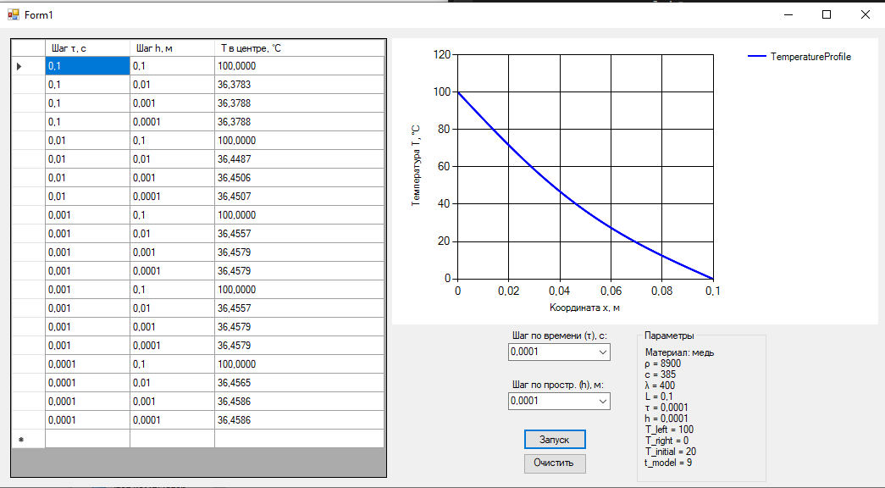

### Метод конечных разностей для уравнения теплопроводности

**Задание:**  
Реализовать моделирование изменения температуры в пластине на основе одномерного уравнения теплопроводности с использованием метода конечных разностей.

Выполнить моделирование с различными шагами по времени и по пространству.  
Заполнить таблицу значений температуры в центральной точке пластины после 2 секунд модельного времени.

## Математическая модель

Рассматривается одномерное уравнение теплопроводности:

\[
\rho c \frac{\partial T}{\partial t} = \lambda \frac{\partial^2 T}{\partial x^2}
\]

где:  
- \(T(x,t)\) — температура в точке \(x\) в момент времени \(t\), °C  
- \(\rho\) — плотность материала, кг/м³  
- \(c\) — удельная теплоёмкость, Дж/(кг·°C)  
- \(\lambda\) — коэффициент теплопроводности, Вт/(м·°C)  
- \(x \in [0, L]\), \(t \in [0, t_\text{model}]\)

Граничные условия:  
\[
T(0,t) = T_\text{left}, \quad T(L,t) = T_\text{right}
\]  

Начальное условие:  
\[
T(x,0) = T_\text{initial}, \quad \forall x \in [0, L]
\]

---

## Численный метод

Использован **метод конечных разностей** с неявной схемой (метод прогонки):

1. Пластина разбивается на **N узлов** с шагом \(h = L/N\).  
2. Время дискретизируется шагом \(\tau\).  
3. Для каждого временного шага вычисляются температуры в узлах:  
   - **Прямая прогонка**: слева направо считаются коэффициенты \(\alpha_i, \beta_i\) для трёхдиагональной системы.  
   - **Обратная прогонка**: справа налево восстанавливаются значения температуры \(T_i^{n+1}\).  
4. Граничные условия применяются на каждом шаге.  
5. После всех шагов выбирается **температура центрального узла** для заполнения таблицы.  

Особенности:  
- Метод устойчив при маленьких шагах по времени и пространству.  
- При слишком крупных шагах (особенно по пространству) центральный узел может совпадать с границей, и результаты будут неточными.
---

## Интерфейс программы

---

## Результаты моделирования
| Шаг по времени, с \ Шаг по пространству, м | 0.1     | 0.01    | 0.001   | 0.0001  |
|-------------------------------------------|---------|---------|---------|---------|
| 0.1                                       | 100.0000| 36.3783 | 36.3788 | 36.3788 |
| 0.01                                      | 100.0000| 36.4487 | 36.4506 | 36.4507 |
| 0.001                                     | 100.0000| 36.4557 | 36.4579 | 36.4579 |
| 0.0001                                    | 100.0000| 36.4565 | 36.4586 | 36.4586 |
---

### Сделаны выводы:
1. **Влияние шага по времени и сетки:**  
   - При крупной сетке `h = 0.1` центральный узел совпадает с левой границей, поэтому температура в центре равна 100 °C.  
   - Для более мелкой сетки (`h ≤ 0.01`) численное решение стабилизируется и корректно отображает распределение температуры.
2. **Влияние шага по пространству:**  
   - Крупная сетка `h = 0.1` не отражает реальное распределение температуры.  
   - Для `h ≤ 0.01` значения температуры практически не изменяются при дальнейшем уменьшении шага.
3. **Рекомендации для точного решения:**  
   - Использовать шаг по времени `τ ≤ 0.01`.  
   - Использовать шаг по пространству `h ≤ 0.01`.  
   - Дальнейшее уменьшение шагов мало влияет на результат и увеличивает вычислительную нагрузку.