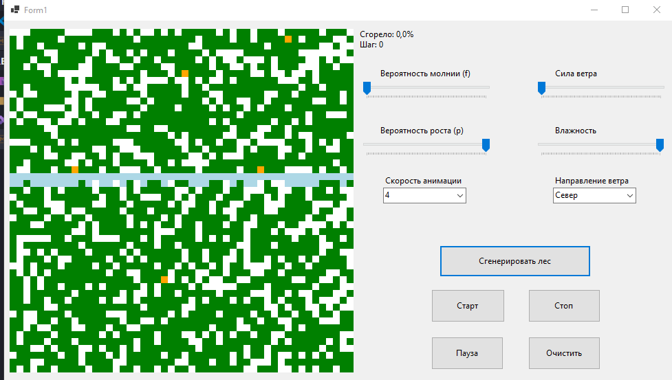

# Лабораторная работа №3: Моделирование лесных пожаров

## 📋 Задание
Реализовать моделирование возникновения и распространения лесных пожаров с использованием двумерного клеточного автомата. Реализовать не менее 3 дополнительных правил.

## 💻 Реализация
Клеточный автомат работает на сетке 50×50 клеток с использованием окрестности Мура (8 соседей). Для корректного одновременного обновления всех клеток применяется двойной буфер (два массива состояний). Распространение огня происходит стохастически с учётом вероятностных факторов: базовая вероятность возгорания от соседа, влияние ветра (направленное распространение), влажность (снижает вероятность пожара и роста деревьев), случайные возгорания от молнии. Визуализация осуществляется через отрисовку цветных прямоугольников в PictureBox.

## 🖼️ Интерфейс программы

## 🔥 Основные правила

| Правило | Описание |
|---------|----------|
| **Горящая клетка → Пустая** | Дерево сгорает за один шаг (детерминировано) |
| **Дерево → Огонь (от соседа)** | Если хотя бы один из 8 соседей горит, дерево загорается с вероятностью ~85% (с учётом модификаторов) |
| **Дерево → Огонь (молния)** | Даже без горящих соседей дерево может загореться от удара молнии с очень малой вероятностью f |
| **Пустая клетка → Дерево** | На пустой клетке может вырасти новое дерево с вероятностью p |
| **Вода → Вода** | Водные преграды не горят и не меняют состояние |

## 🌪️ Дополнительные правила

### 1. Ветер (направленное распространение)
- Направление: Север, Юг, Запад, Восток
- Сила ветра: 0–100%
- Огонь распространяется быстрее по направлению ветра и медленнее против ветра
- Реализовано через векторную математику: `windFactor = (dj * windX + di * windY) * windForce`

### 2. Влажность
- Диапазон: 0–100%
- Снижает вероятность возгорания от соседа до 50% (при 100% влажности)
- Снижает вероятность случайного возгорания от молнии до 0% (при 100% влажности)
- Немного снижает вероятность роста деревьев (на 30% при 100% влажности)

### 3. Препятствия (река)
- При генерации создаётся горизонтальная водная преграда в случайном месте
- Вода блокирует распространение огня
- Вода не может гореть и не изменяется со временем

## 🎮 Управление

| Кнопка | Действие |
|--------|----------|
| Сгенерировать лес | Создание новой карты (70% деревьев, река, 5 очагов огня) |
| Старт | Запуск симуляции |
| Продолжить | Возобновление после паузы |
| Стоп | Остановка с финальной статистикой |
| Очистить | Полная очистка карты |
| Скорость анимации | 5 уровней (1–5) |

## 📊 Статистика

| Параметр | Описание |
|----------|----------|
| Шаг | Номер текущего шага симуляции |
| Сгорело | Процент уничтоженных деревьев от общего количества |

---
