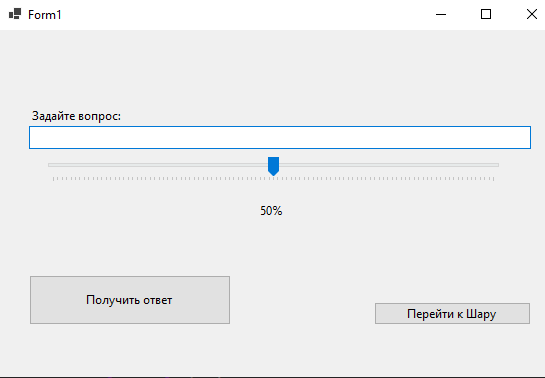

# Лабораторная работа

## Моделирование случайных событий (GUI)

---

## Задание

Часть 1:
Реализовать приложение «Скажи “да” или “нет”».

Часть 2:
Реализовать приложение «Шар предсказаний» (Magic 8-Ball).

---

## Математическая модель

В основе обоих приложений лежит генерация равномерно распределённой случайной величины:

α ∈ [0, 1]

Используется мультипликативный конгруэнтный генератор:

xₙ₊₁ = (β · xₙ) mod M
uₙ = xₙ / M

---

### Часть 1 — «Да или Нет»

Генерируется случайное число α.

Сравнение с вероятностью p:

* если α < p → результат "ДА"
* иначе → "НЕТ"

Вероятность p задаётся пользователем (ползунок).

---

### Часть 2 — Magic 8-Ball

Используется разбиение интервала [0,1] на три части:

* [0, 0.5) → положительный ответ
* [0.5, 0.75) → нейтральный ответ
* [0.75, 1] → отрицательный ответ

После выбора категории случайно выбирается конкретная фраза из массива.

---

## Результаты

### Интерфейс приложения

#### Приложение «Да или Нет»

#### Приложение «Шар предсказаний»

---

### Пример работы

#### Да или Нет

* вероятность: 50%
* результаты распределяются примерно равномерно
* ведётся подсчёт количества "ДА" и "НЕТ"

#### Magic 8-Ball

* положительные ответы ≈ 50%
* нейтральные ≈ 25%
* отрицательные ≈ 25%

Результаты соответствуют заданным вероятностям.

---

## Выводы

1. Реализовано моделирование случайных событий на основе равномерного распределения.

2. В приложении «Да или Нет» вероятность события задаётся пользователем, что позволяет управлять распределением результатов.

3. В приложении Magic 8-Ball реализовано разбиение пространства вероятностей на несколько категорий.

---
