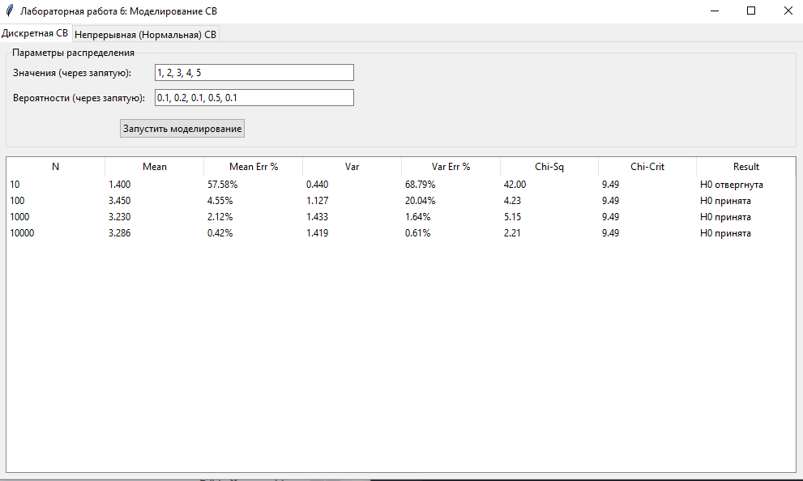
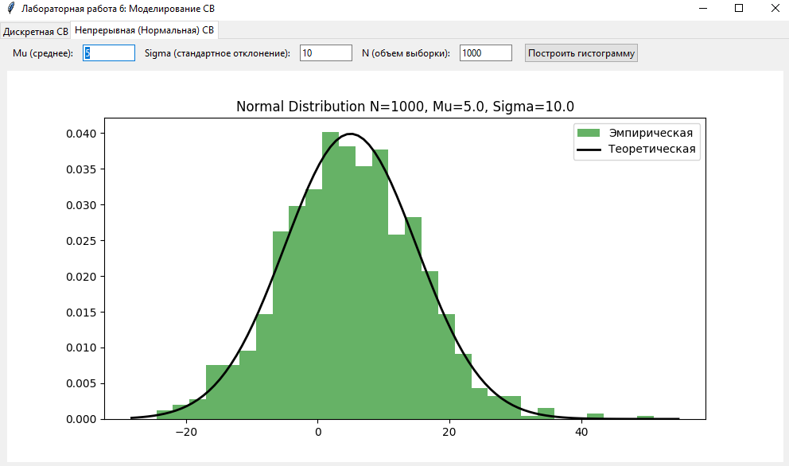

# Лабораторная работа 6

## Имитационное моделирование случайных величин

---

## Задание:
- реализовать генерацию дискретной случайной величины, заданной рядом распределения;
	- вычислить эмпирические вероятности;
	- вычислить выборочные среднее и дисперсию, их относительные погрешности;
	- вычислить статистику χ² и применить критерий χ² при:
	  - N = 10, 100, 1 000, 10 000;
- Реализовать генератор нормальной случайной величины, 
	- построить гистограммы 
	- сравнить точность моделирования при разных объёмах выборки.
- сделать вывод.

---

## Математическая модель

### 1. Базовый датчик (равномерное распределение)

В основе всех экспериментов лежит генерация последовательности псевдослучайных чисел  
\(\alpha \in [0,1)\), равномерно распределённых на интервале.

Используется мультипликативный конгруэнтный метод:

\[
x_{n+1} = (\beta \cdot x_n) \mod M
\]

\[
\alpha = \frac{x_{n+1}}{M}
\]

**Параметры:**
- \( M = 2^{63} = 9223372036854775808 \)
- \( \beta = 2^{32} + 3 = 4294967299 \)

---

### 2. Моделирование дискретной случайной величины

Для генерации дискретной случайной величины \(X\) с распределением  
\(P(X = x_i) = p_i\) используется **метод интервалов**:

1. Строится функция распределения \(F(x)\) (накопление вероятностей).
2. Генерируется \(\alpha \in [0,1)\).
3. Находится \(x_i\), для которого:
   \[
   F(x_{i-1}) \le \alpha < F(x_i)
   \]

#### Статистическая обработка

**Эмпирическое среднее:**
\[
\bar{x} = \frac{1}{N} \sum_{j=1}^{N} x_j
\]

**Эмпирическая дисперсия:**
\[
D = \frac{1}{N} \sum_{j=1}^{N} (x_j - \bar{x})^2
\]

#### Критерий согласия \(\chi^2\)

Сравниваются наблюдаемые частоты \(n_i\) и теоретические \(N \cdot p_i\):

\[
\chi^2 = \sum_{i=1}^{m} \frac{(n_i - N p_i)^2}{N p_i}
\]

Если:
\[
\chi^2 < \chi^2_{\text{crit}}
\]
гипотеза о согласии распределений принимается.

---

### 3. Моделирование нормальной случайной величины

Используется метод Бокса–Мюллера для получения стандартной нормальной величины  
\(\zeta \sim N(0,1)\) из двух равномерных \(\alpha_1, \alpha_2\):

\[
\zeta = \sqrt{-2 \ln \alpha_1} \cdot \cos(2\pi \alpha_2)
\]

Переход к нормальному распределению с параметрами:
- \(a\) — математическое ожидание
- \(\sigma\) — среднеквадратичное отклонение

\[
\xi = a + \sigma \cdot \zeta
\]

---

## Результаты

### Интерфейс приложения

####  Вкладка "Дискретная СВ"

####  Вкладка "Непрерывная СВ"

---

## Выводы

1. `Сходимость оценок:` Экспериментально подтверждено, что с увеличением объема выборки N эмпирические характеристики (среднее и дисперсия) стремятся к своим теоретическим значениям. Относительные погрешности уменьшаются обратно пропорционально росту N.

2. `Критерий согласия:` Критерий хи-квадрат показал свою эффективность. На малых выборках (N=10,100) случайные колебания приводят к большим значениям статистики χ2, из-за чего гипотеза о соответствии распределению часто отвергается. На больших выборках (N≥1000) статистика стабилизируется и становится меньше критического значения, что свидетельствует об адекватности модели.

3. `Качество генератора:` Мультипликативный конгруэнтный метод с подобранными параметрами M и β обеспечивает достаточную длину периода и равномерность распределения базовых чисел, что позволяет успешно применять его для моделирования как дискретных, так и сложных непрерывных распределений (в частности, нормального через преобразование Бокса-Мюллера).

---
