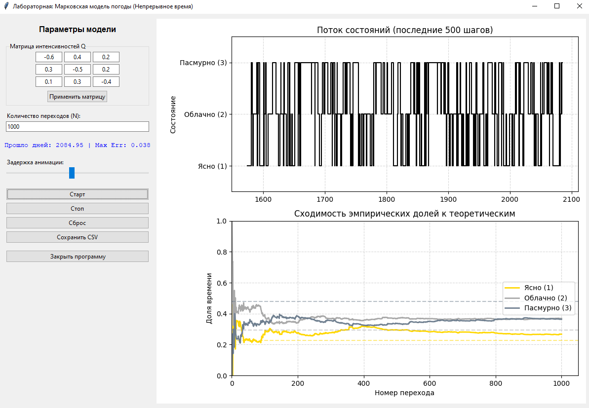

# Лабораторная работа 7

## Имитационное моделирование цепи Маркова с непрерывным временем

---

## 1. Цель работы
Разработать программную модель марковского процесса с непрерывным временем на примере системы изменения погодных условий («Ясно», «Облачно», «Пасмурно»). Реализовать генерацию траектории процесса, рассчитать эмпирические характеристики (доли времени пребывания в состояниях) и сравнить их с теоретическим стационарным распределением.

---

## 2. Математическая модель

### 1. Описание процесса

Моделируемая система представляет собой однородную цепь Маркова с непрерывным временем и конечным числом состояний $S = \{1, 2, 3\}$. Поведение системы полностью определяется матрицей интенсивностей переходов $Q = [q_{ij}]$, где:
*   $q_{ij} \ge 0$ при $i \neq j$ — интенсивность перехода из состояния $i$ в состояние $j$.
*   $q_{ii} = -\sum_{j \neq i} q_{ij}$ — диагональный элемент, определяющий суммарную интенсивность ухода из состояния $i$ ($\lambda_i = -q_{ii}$).

---

### 2. Алгоритм статистических испытаний

Моделирование одного шага процесса (перехода из текущего состояния $i$) выполняется в два этапа:

1.  **Генерация времени пребывания $\tau$**.
    Поскольку процесс марковский, время нахождения в состоянии $i$ до момента перехода имеет экспоненциальное распределение с параметром $\lambda_i$. Генерация осуществляется по формуле:
    $$ \tau = -\frac{\ln U}{\lambda_i}, \quad U \sim R(0,1) $$
    В реализации используется стандартный генератор экспоненциально распределенных величин библиотеки `NumPy`.

2.  **Выбор следующего состояния $j$**.
    Вероятность перехода в конкретное состояние $j$ пропорциональна интенсивности этого перехода:
    $$ P_{ij} = \frac{q_{ij}}{\lambda_i}, \quad j \neq i $$
    Выбор следующего состояния реализуется как розыгрыш дискретной случайной величины с заданным рядом распределения $\{P_{ij}\}$.

---

### 3. Стационарное распределение

Теоретические доли времени пребывания в состояниях $\pi = [\pi_1, \pi_2, \pi_3]$ находятся как решение системы линейных уравнений:
$$ \pi Q = 0, \quad \sum_{k=1}^{3} \pi_k = 1 $$
Эмпирическое распределение $\hat{\pi}_i$ оценивается как отношение суммарного времени, проведенного в состоянии $i$, к общему времени моделирования $T$:
$$ \hat{\pi}_i(T) = \frac{T_i(T)}{T} $$
Согласно эргодической теореме, при $T \to \infty$ эмпирические оценки должны сходиться к теоретическим значениям $\pi_i$.

---

## 3. Программная реализация

Программа разработана на языке Python с использованием библиотек `NumPy` для вычислений, `Matplotlib` для визуализации и `Tkinter` для создания графического интерфейса. 

### 3.1. Структура приложения
Интерфейс разделен на две функциональные области:
*   **Панель управления**: Позволяет задавать матрицу интенсивностей $Q$, устанавливать количество шагов моделирования $N$, регулировать скорость анимации и управлять процессом (Старт/Стоп/Сброс). Также предусмотрена валидация введенной матрицы (проверка неотрицательности внедиагональных элементов и равенства нулю сумм строк).
*   **Область визуализации**: Содержит два динамически обновляемых графика:
    1.  *Поток состояний*: Отображает последовательность состояний во времени (ступенчатый график). Для оптимизации производительности отображаются только последние 500 точек.
    2.  *Сходимость вероятностей*: Демонстрирует изменение эмпирических долей времени $\hat{\pi}_i(t)$ в процессе накопления статистики. Теоретические значения $\pi_i$ отмечены пунктирными линиями для наглядного сравнения.

### 3.2. Ключевые методы реализации

**Инициализация и расчет теории**
При запуске приложения производится расчет теоретического стационарного распределения методом решения системы линейных уравнений (`numpy.linalg.solve`). Начальное состояние выбирается как наиболее вероятное согласно вектору $\pi$, что позволяет минимизировать влияние переходного процесса на начальном этапе симуляции.

**Логика симуляции (`update_simulation_step`)**
Основной цикл моделирования запускается через механизм событий Tkinter (`root.after`). На каждом шаге выполняются следующие действия:
1.  Вызов метода `get_next_step_data`, который возвращает время пребывания $\tau$ и индекс следующего состояния.
2.  Накопление статистики: увеличение счетчика общего времени и времени пребывания в текущем состоянии.
3.  Пересчет эмпирических вероятностей и максимальной абсолютной погрешности относительно теоретического распределения.
4.  Обновление данных на графиках и планирование следующего шага с задержкой, определяемой пользователем.

**Обработка данных и экспорт**
Накопленные данные сохраняются в структуре `log_data` (список словарей). Формируется два CSV-файла с помощью библиотеки `pandas`:
*   `summary.csv`: Содержит сводную таблицу сравнения теоретических и эмпирических вероятностей, а также абсолютные ошибки.
*   `trajectory.csv`: Содержит подробный лог каждого шага симуляции (номер шага, код состояния, длительность пребывания, накопленное время).

---

## Интерфейс приложения

---
## 5. Выводы

1.  Разработана интерактивная программа для имитационного моделирования цепи Маркова с непрерывным временем.
2.  Реализованный алгоритм корректно воспроизводит свойства марковских процессов: время пребывания в состояниях распределено экспоненциально, а выбор следующего состояния зависит только от текущих интенсивностей переходов.
3.  Эмпирические доли времени пребывания в состояниях стремятся к теоретическому стационарному распределению при увеличении объема выборки.
4.  Использование графического интерфейса и динамической визуализации позволяет наглядно наблюдать процесс установления стационарного режима.